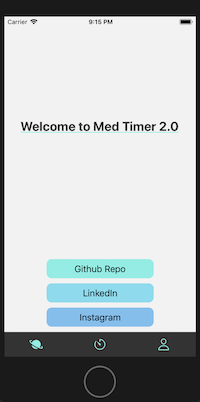
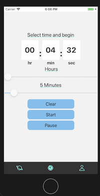
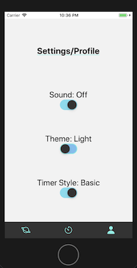

# ⌛️ MEDITATION TIMER 2.0 ⏱

```markdown
- created with: `npx create-react-native-app -t with-typescript`
- run: `npm start` - expo ios essentially
- test: `npm test` - jest unit testing
- linter: prettier with airbnb setting (doubleQuote: true preferred)
```

---

<article>
  <h3>State Management with Akita Stores</h3>
  <table>
<thead>
<tr>
<th>Feature</th>
<th>State</th>
<th>Status</th>
</tr>
</thead>
    <tbody>
      <tr>
        <td>Toggle Sound</td>
        <td>On / Off</td>
<td>✓</td>
      </tr>
     <tr>
        <td>Dark mode</td>
        <td>On / Off</td>
<td>wip</td>
      </tr>
      <tr>
        <td>Timer Style</td>
        <td>Default / Basic</td>
<td>wip</td>
      </tr>
    </tbody>
  </table>
</article>

---






